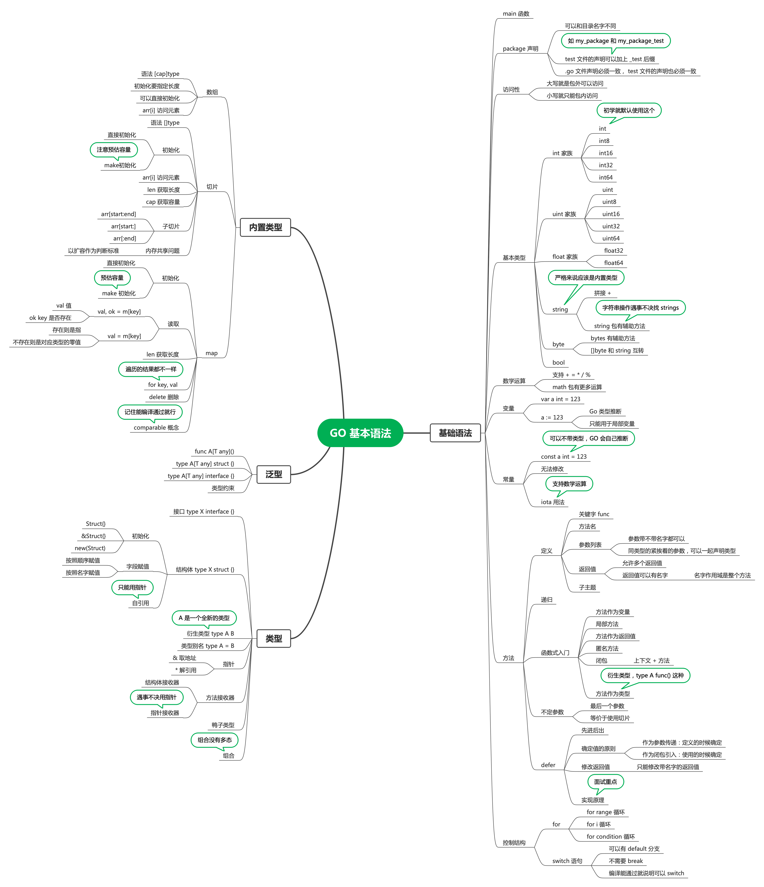
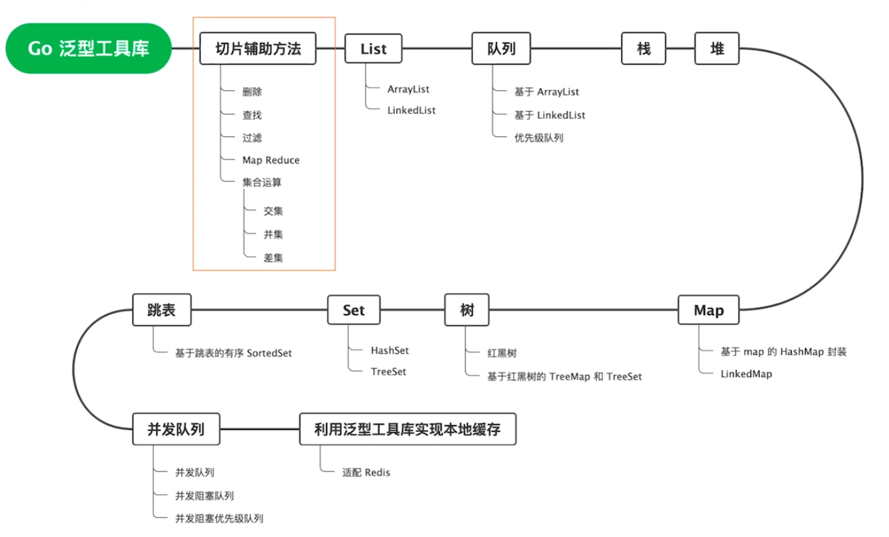
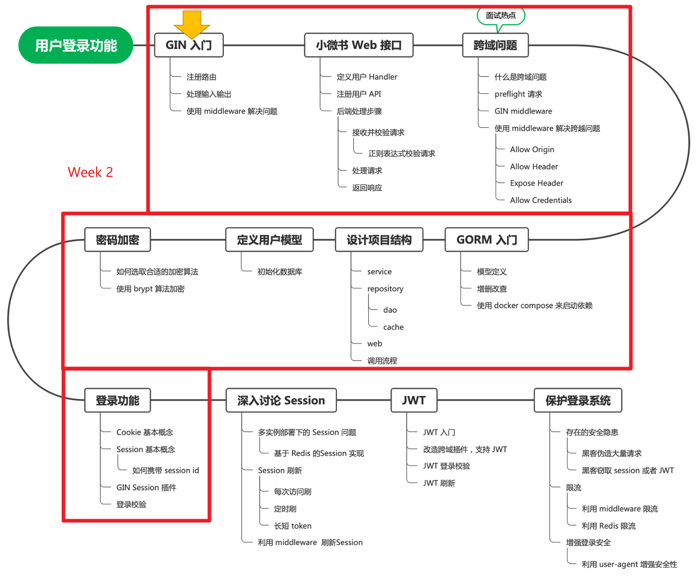
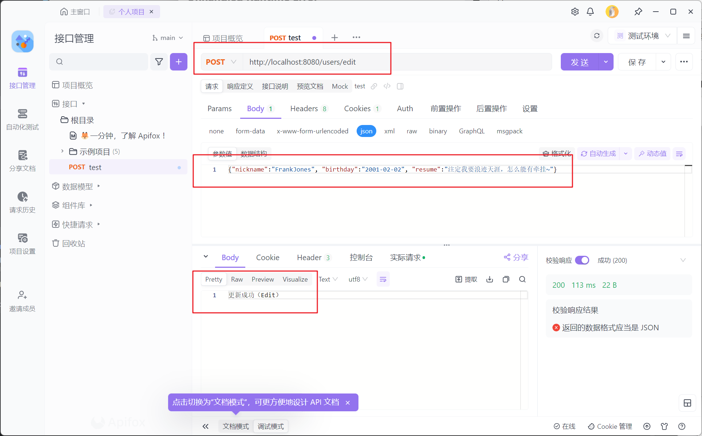
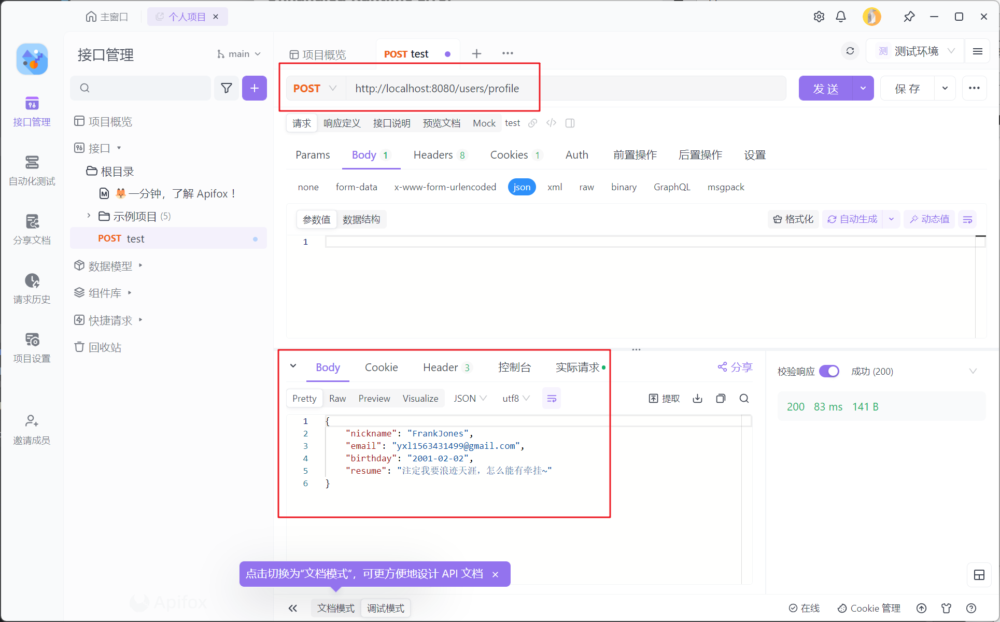
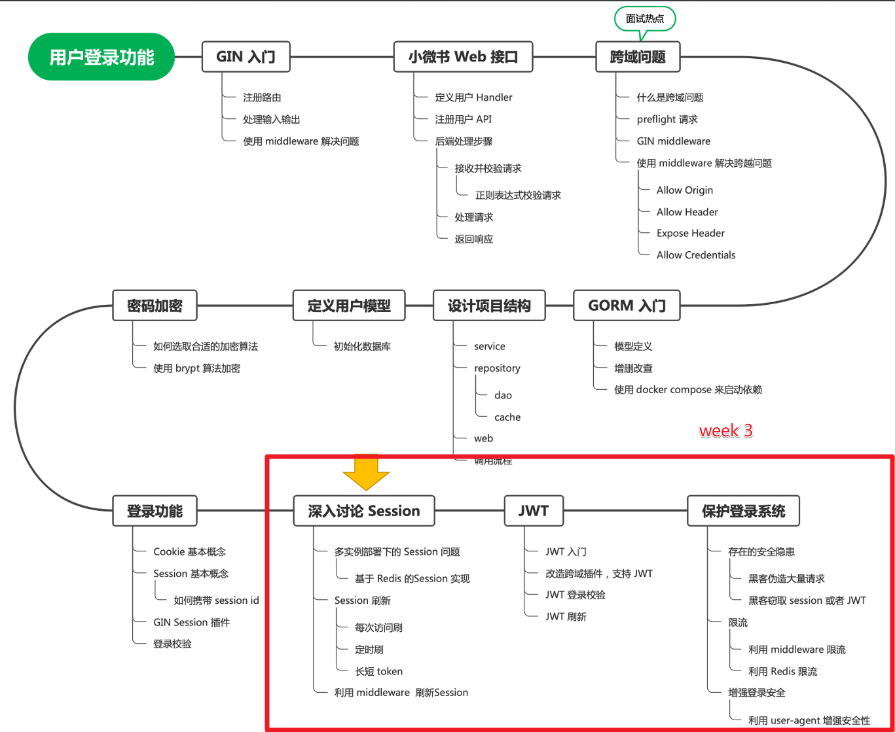
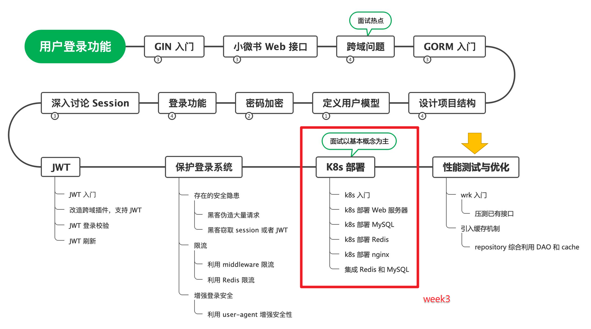
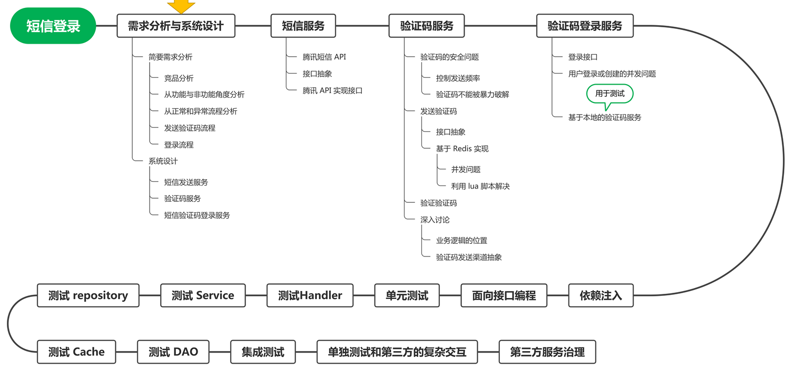

## Golang学习（ready for 2026校招）

### Week 1 Go基础语法
学习时间： 2024/4/3 —— 2024/4/6

学习内容：（Go基本语法总结）

待提升：
1. 搭建自己的 <b>Go泛型工具库<b>

学习参考：https://github.com/ecodeclub/ekit/tree/dev/internal/slice

### Week 2 Gin、GORM入门与用户注册登录功能实现

学习时间： 2024/4/7 —— 2024/4/10

学习内容：（Gin和Gorm）
1. 如图
   

2. 完成了handler层中edit()和profile()的编写
3. 基于cookie的实现保存session数据

作业截图：【接口测试工具：Apifox】

1. edit接口测试
   

2. profile接口测试
   

### Week 3 JWT、Redis入门和Kubernetes部署实战

学习时间： 2024/4/10 —— 2024/4/14

学习内容：
1. 如图
   

2. 跳过了“用k8s部署web、mysql和redis”，进度在“k8s部署web服务器”视频的29:33处。
【跳过原因：1. k8s命令琐碎，跳过不影响后续课程 2. 面试时重点在回答概念，且入职后确保自己在公司接触到k8s的时候，能够看懂公司的k8s部署配置就行】

### Week 4 接口抽象技巧和短信服务

学习时间： 2024/4/15 —— 2024/4/

学习内容：
1. 上图的“压测与缓存机制”
2. 短信服务实现
   

待更。。。。